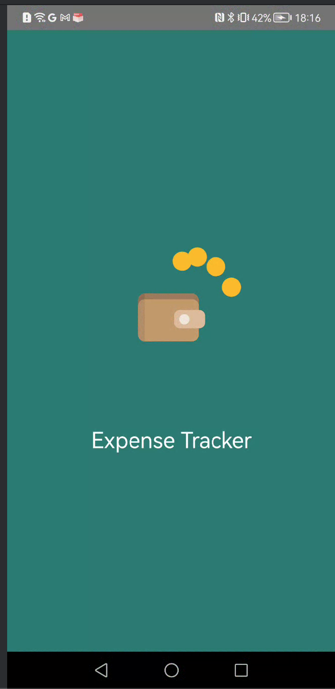
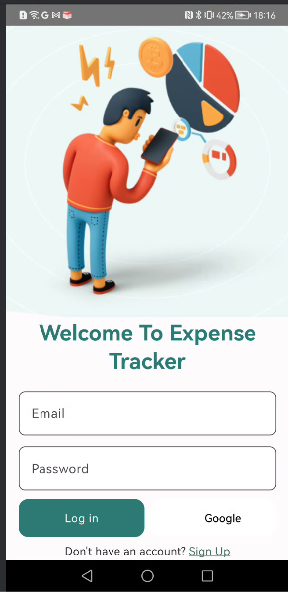
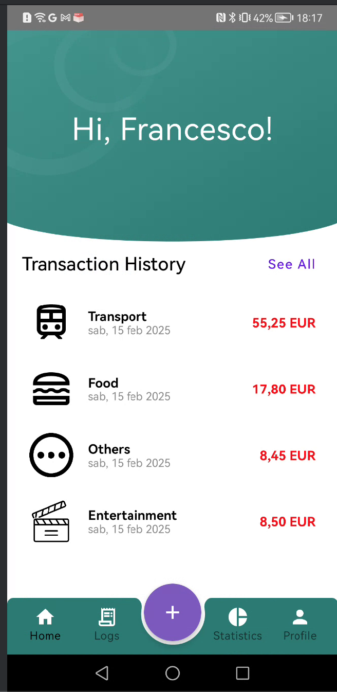
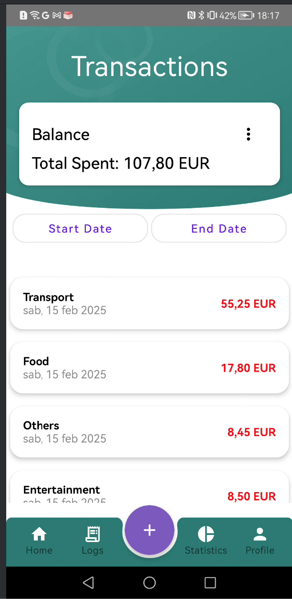
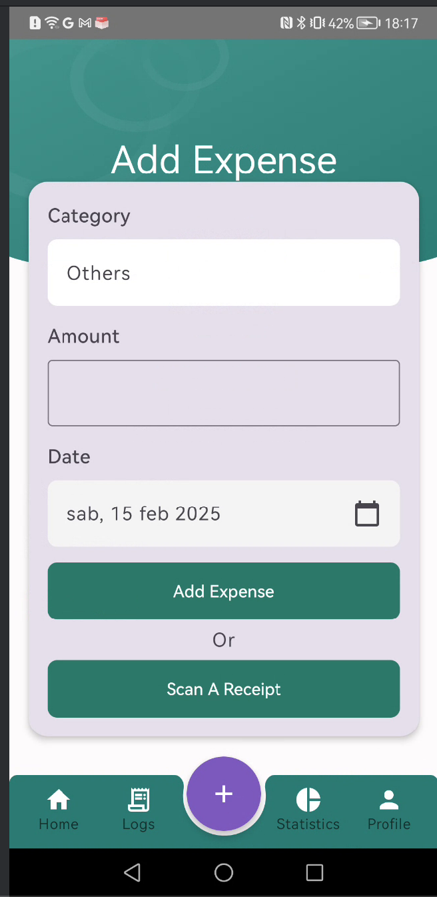
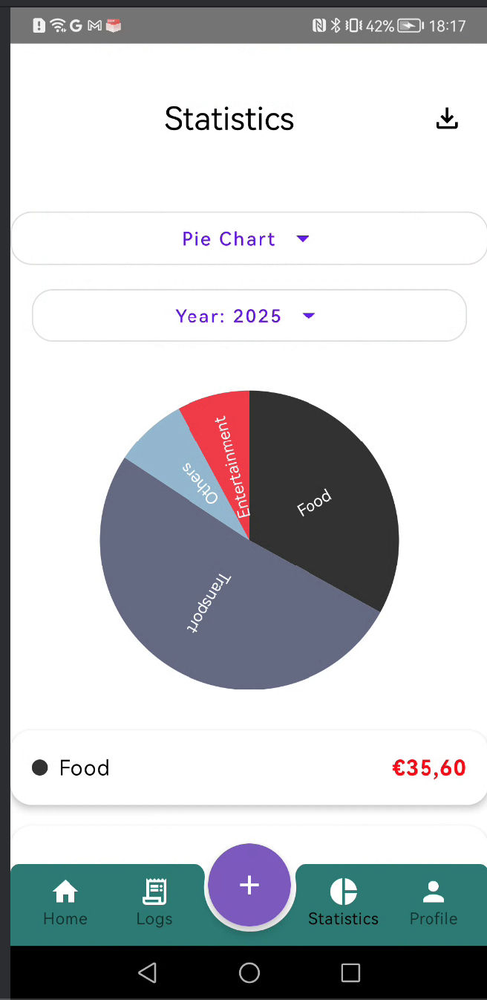
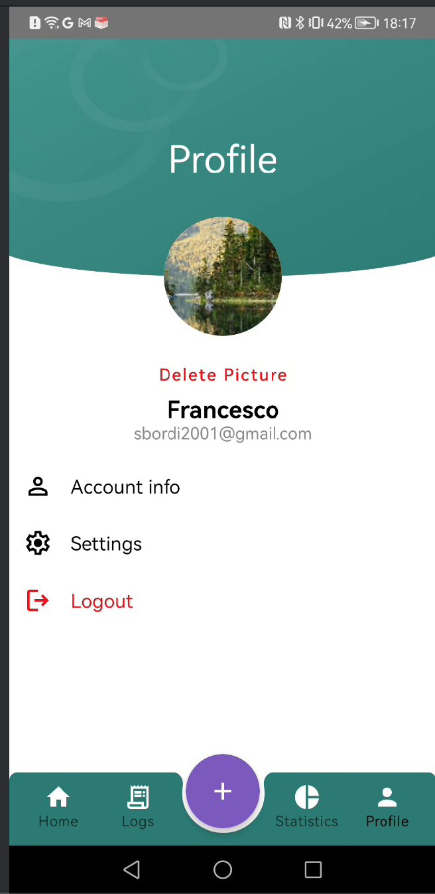

# 📊 Expense Tracker

Expense Tracker is a **personal finance management app** that helps users track their expenses, categorize transactions, and visualize spending habits. The app supports **manual entry and OCR-based expense logging** by scanning receipts.

## 🚀 Features

### 🔹 Authentication
- **Splash Screen** → Displays the app logo on startup.

- **Login / Sign-Up** → Users can sign in **via Google** or create an account.

### 🔹 Expense Management
- **🏠 Home Screen** → Displays the **4 most recent transactions**.

- **💳 Transactions Screen** →
  - Shows a **balance card** with total spending.
  - Lists **all transactions**, which can be **deleted by swiping left**.
  - Allows **currency conversion** using an external API.
  - Provides **date filters** to view expenses within a specific range.

### 🔹 Expense Input
- **📝 Add Expense Screen** →
  - Users can **manually enter expenses**.
  - Alternatively, they can **scan receipts** or **upload images**. The receipt is processed using **OCR (Optical Character Recognition)** via a Flask API.

### 🔹 Data Visualization
- **📊 Statistics Screen** →
  - Interactive **Bar, Pie, and Line charts** to analyze spending.
  - Ability to **download statistics as a CSV file**.
  - Provides **date filters** to view expenses within a specific year.

### 🔹 User Profile
- **👤 Profile Screen** →
  - Users can **change their username**.
  - Upload and **edit profile pictures** (crop, flip, rotate).
  - **View** when account was created.
  - **Logout** from the app.
  

## 🛠️ Tech Stack
- **Frontend** → Jetpack Compose (Kotlin)
- **Backend** → Firebase Firestore (Database), Flask (OCR API)
- **Authentication** → Firebase Authentication (Google Sign-In)
- **Image Processing** → OCR techniques (Google ML) via Flask API
- **Charts & Analytics** → MPAndroidChart for data visualization

